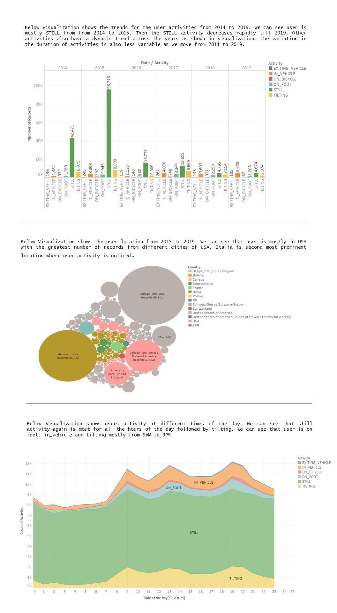

# Project

The final project for CPSC8040, Fall 2019. Create a static infographic with Tableau.

Notice - this is not a publicly available dataset. You are allowed to use the dataset and you can share the results of your project but you are not allowed to share the dataset elsewhere.

The dataset is a collection of geolocations describing the movements of a person from ~2014 to 2019. The dataset contains the following attributes:
- Activity: a value identifying the type of activity/movement performed by the person as recorder by the Google Maps API
- Date: date of when the event was recorded
- Hour: time of the day when the event was recorded
- City: City where the person was
- County: County where the person was
- State: State where the person was
- Country: Country where the person was

### Instructions

Create a single infographic including 3 figures created with tableau. Each figure can be composed of multiple views. The infographic can be assembled either inside Tableau or by using a vector graphic software like Adobe Illustrator or Inkscape.

Each figure should show an interesting pattern or something you have discovered by visually analyzing the dataset. For example, where the person used to leave, work, what are her/his abhits, etc.

You are not allowed to use the same visualization idiom twice (i.e., if your main image in figure 1 has a bar chart, you are not allowed to use a bar chart for the remaining figures).

### Submission

Upload the final infographic created plus all the material used to generate it (workbook, svg or ia files, text files, etc.)

### Grade

An infographic should be a self-contained story speaking mainly with images. You are allowed to use text to fill the holes between one figure and another and to provide the narrative.

The overall infographic can score 15 points (5x3 points).
For each figure you can collect:
- 1.5 points, Effective. The image and the associated text contains an effective description of the pattern you have found
- 2 points, Efficiency. By using the figure a user can intuitively see the behavior/pattern you are talking about.
- 1.5 points, Style. The images are well organized, well-formatted and the font and colors are consistent and visually appealing. Legend and titles are visible, etc.

Bonus points.
If you score 15/15 and your infographic is jaw-dropping you will get 5 bonus points. To get these I need to be impressed by how you choose your visualization for building the story. On top of that, you need to have a perfectly formatted and appealing infographic.

### Hint

When using maps you will notice that Tableau does not recognize a lot of the locations provided since it assumes you are referring to locations in the US only. By clicking on the unknown fields (shown on screen in the lower right corner) you can fix this by using table names for interpreting the Country, State, City of each point. You will still get a few points as unknown. You can just ignore them. ok

### Final Infographic

