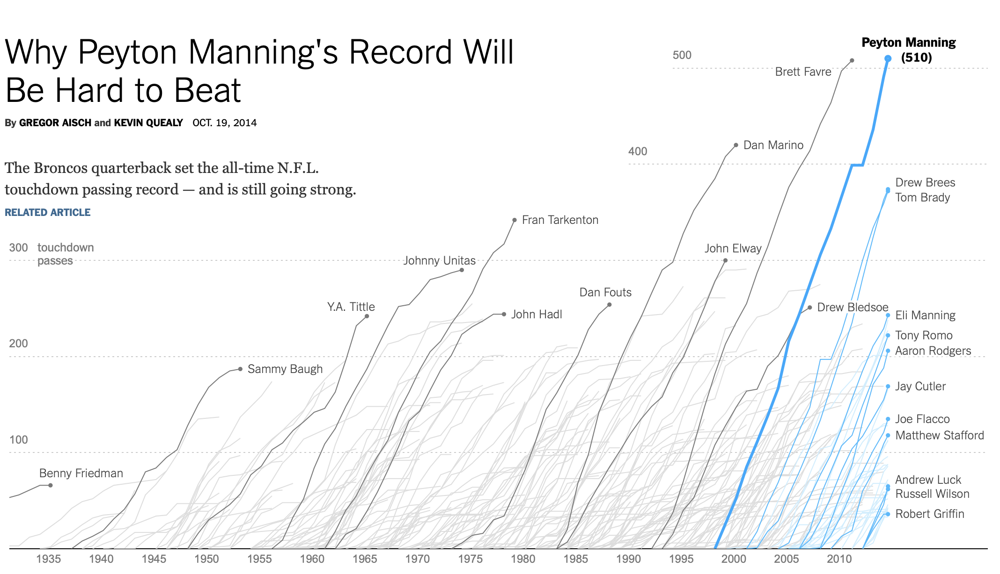
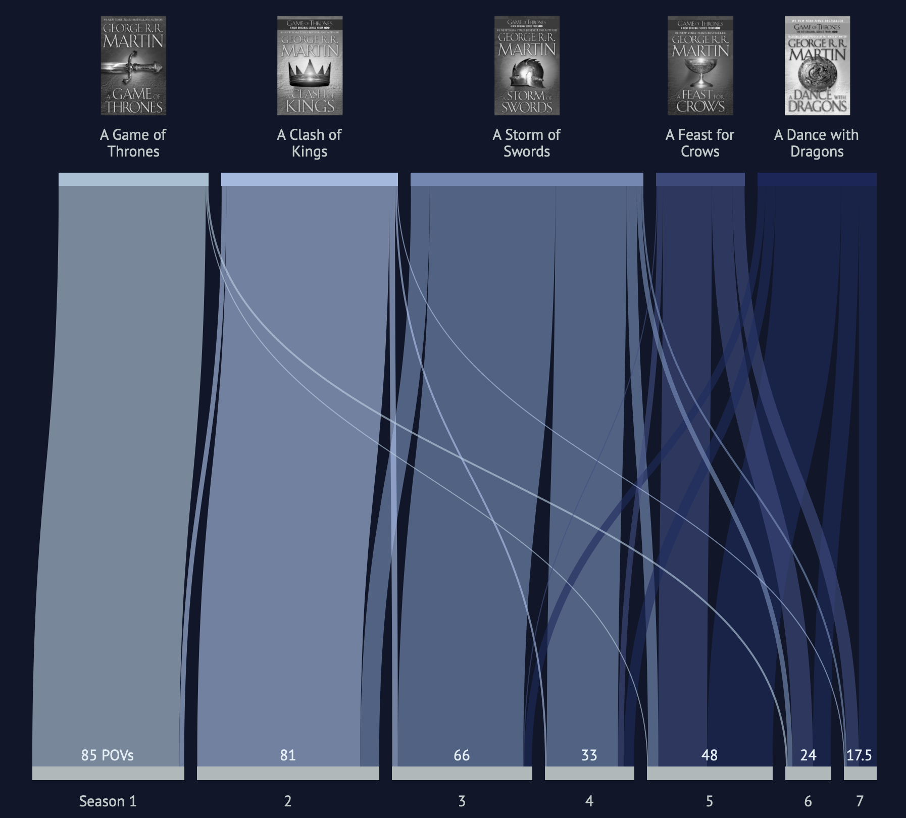
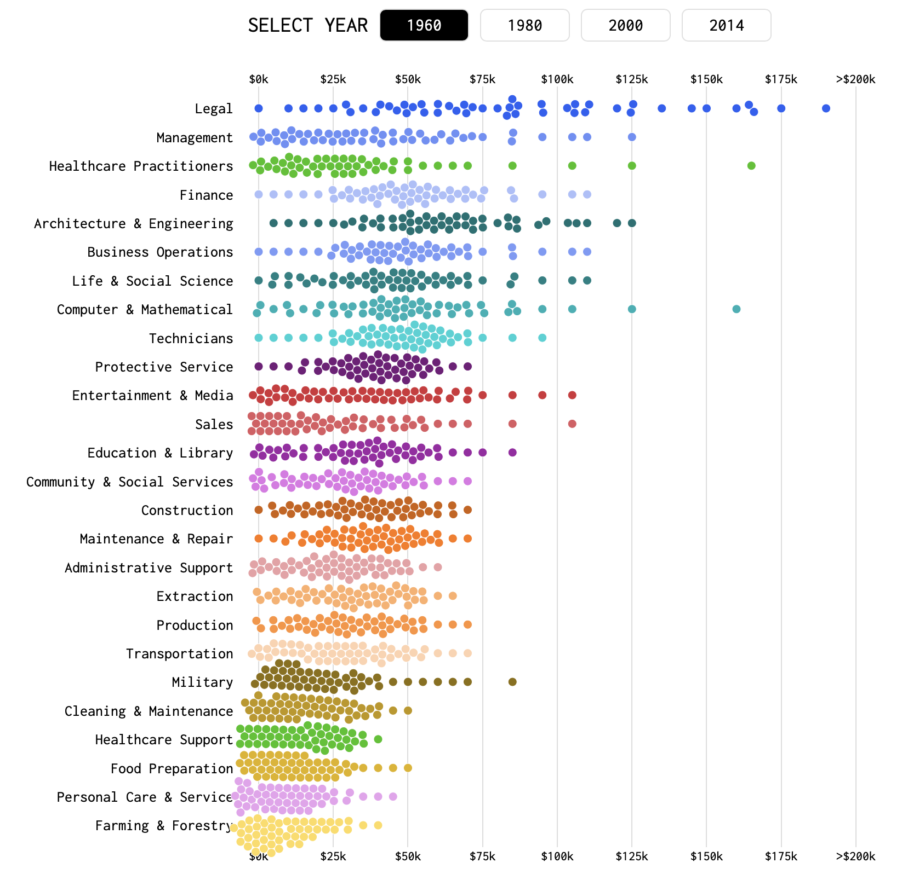
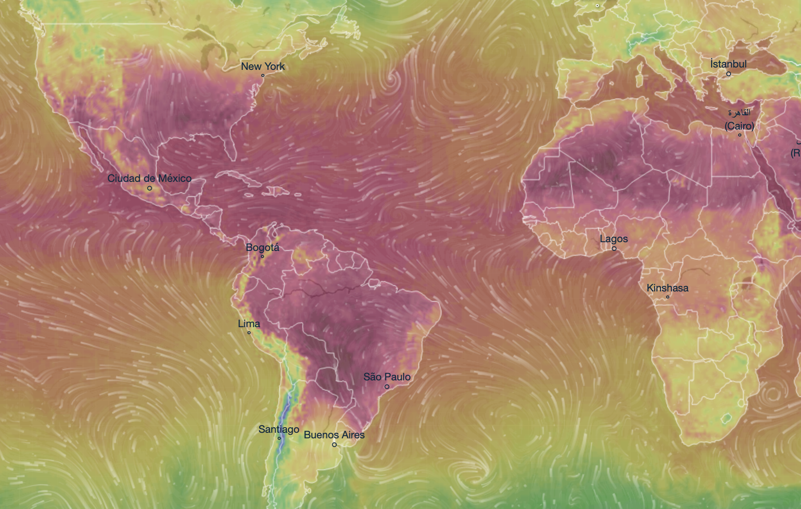

# Assignment 1 - Decoding charts

### Learning Goal
Train yourself in decoding charts so that you can better understand how every single visualization can be described using the language and rules of visual encoding and decomposed into low-level graphical components.

### Instructions

For each of the following charts identify:

- Dataset type
- Data attributes

Use the following template for returning your answers.

- Dataset type:
  - ...

- List of data attributes:
  - Attribute 1, Attribute 2, ...

- For each attribute:
  - Attribute 1 is of type ... encoded as ...
  - Attribute 2 is of type ... encoded as ...
  - ...

NOTE: visit the corresponding link for each chart. Do not use solely the figures provided here.

### Submission

Modify this same README file adding your comments and descriptions after each image.

### Charts

#### Chart 1 - [link](https://archive.nytimes.com/www.nytimes.com/interactive/2012/02/12/us/entitlement-map.html)

#### Dataset Type: Multi-Dimensional Table  
•	Items: County which is marked by area and position

#### List of Data Attributes:
All Government Benefits, Social Security, Medicare, Medicaid, Income Support, Veterans Benefits, Unemployment Insurance, Year, Name of county

#### For each attribute: 
•	All government benefits are of quantitative type and encoded as color  
•	Social Security is of quantitative type and encoded as color  
•	Medicare is of quantitative type and encoded as color  
•	Medicaid is of quantitative type and encoded as color  
•	Income Support is of quantitative type and encoded as color  
•	Year is of ordinal type  
•	Veteran Benefits is of quantitative type and encode as color  
•	Unemployment Insurance is of quantitative type and encoded as color  
•	Name of county is of categorical type and encoded as area  

#
#### Chart 2 - [link](http://www.nytimes.com/interactive/2014/10/19/upshot/peyton-manning-breaks-touchdown-passing-record.html)

##### Dataset Type: Geometry
•	Items: players which is marked by lines

##### List of Data Attributes: 
Year, Player Names, Total Touchdown passes by players, Age

##### For each attribute:
•	Year is of type ordinal and is encoded as horizontal line  
•	Player names are of type ordinal and encoded as lines identifier  
•	Total Touchdown passes is of type quantitative and encoded as tilted lines along y-axis  
•	Age is derived quantitative attribute encoded as position on visualization  

#
#### Chart 3 - [link](http://got-books-to-series.surge.sh) [Spoiler alert for GoT]

##### Dataset Type: This link had 2 visualizations:
 A) Network   
 B) Table  

##### 1. List of Data Attributes for A) Network visualization:
Books and Seasons (Game of thrones, A Clash of Kings, Storm of Swords, A feast for crows, A dance with dragons, Season 1 Season 2, Season 3, Season 4, Season 5, Season 6, Season 7)

##### 2. For each attribute:
•	Books are of type categorical and encoded as lines and length  
•	Seasons are of type categorical and encoded as lines and length  
•	Points of view (POV) is of type quantitative and encoded as shape and lines

##### 1. List of Data Attributes for B) Table visualization:
Episodes, Seasons, length of scenes & scene resemblance

#####  2. For each attribute:
•	Episodes are of type ordinal and encoded as colors and area  
•	Seasons are of type ordinal and encoded as colors and area  
•	Length of scenes is of type quantitative and encoded as area  
•	Scene resemblance are of type categorical and encoded as colors

#
#### Chart 4 - [link](https://flowingdata.com/2016/06/28/distributions-of-annual-income/)

##### Dataset Type: Multi-dimensional table
•	Items: People with occupations which is marked by points on graph

##### List of Data Attributes:
Occupation, Salary, Year

##### For each attribute:
•	Occupation is of type categorical and encoded as categories on y axis of table  
•	Salary is of type quantitative and encoded as multi-colored points on graph on x -axis  
•	Year is of type ordinal and is encoded as 3rd dimension and decides the points on graph  

#
#### Chart 5 - [link](https://www.ventusky.com)

##### Dataset Type: Field
•	Items: Location which is marked by area

##### List of Data Attributes:
Temperature, Altitude, Perceived temperature, Precipitation, Radar, Clouds, Wind speed, Wind gusts, Air pressure, Thunderstorm, Humidity, Waves, Snow cover, Freezing level, Date, Wave Animation, Time

##### Attribute   is of the type:
•	Temperature is of type quantitative and encoded as color  
•	Altitude is of type quantitative and encoded as color  
•	Perceived Temperature is of quantitative type derived from temperature and encoded as color  
•	Precipitation is of type quantitative and encoded as color  
•	Radar is of type quantitative and encoded as color  
•	Clouds is of type quantitative and encoded as color and area  
•	Wind Speed is of type quantitative and encoded as color  
•	Wind gusts is of type quantitative and encoded as color 
•	Air pressure is of type quantitative and encoded as color  
•	Thunderstorm is of type quantitative and encoded as color  
•	Humidity is of type quantitative and encoded as color  
•	Waves is of type quantitative and encoded as color  
•	Snow cover is of type quantitative and encoded as color  
•	Freezing level is of type quantitative and encoded as color  
•	Wave Animation is of type categorical and encoded as lines and color  
•	Date is of type quantitative and encoded as position  

