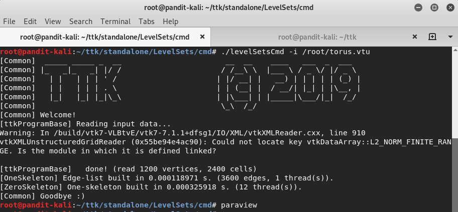
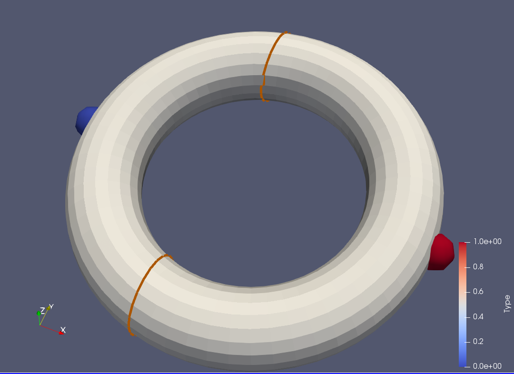
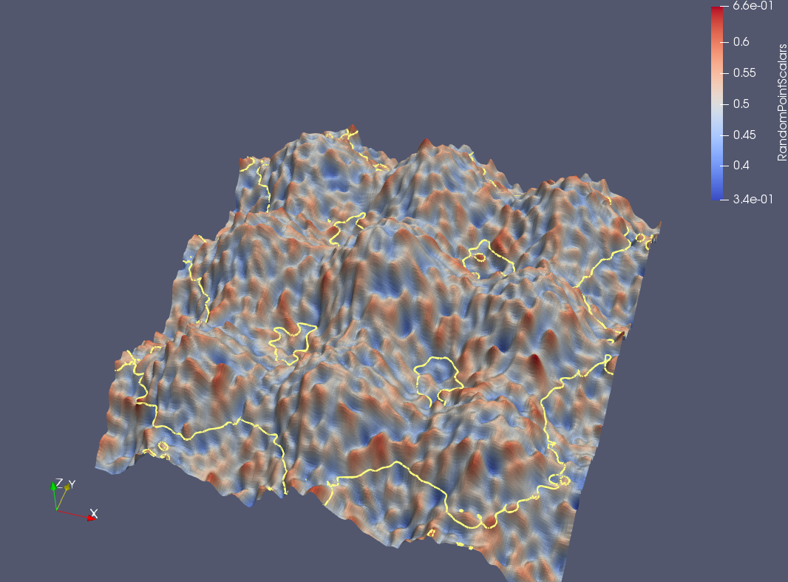
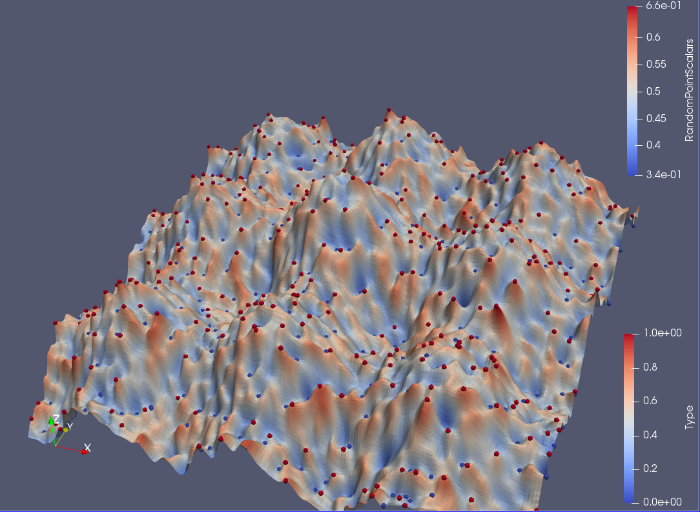
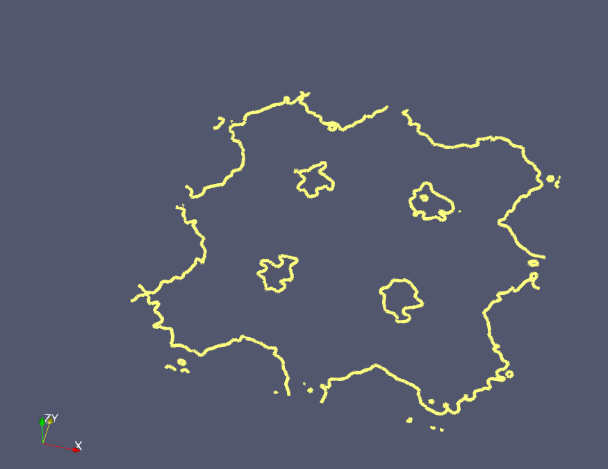
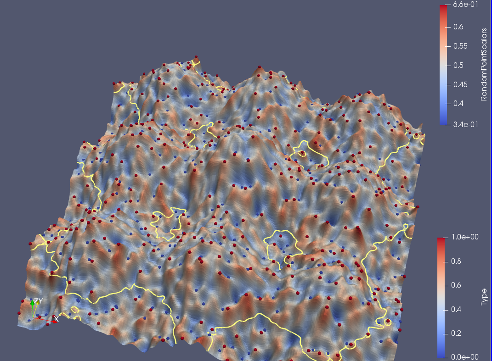
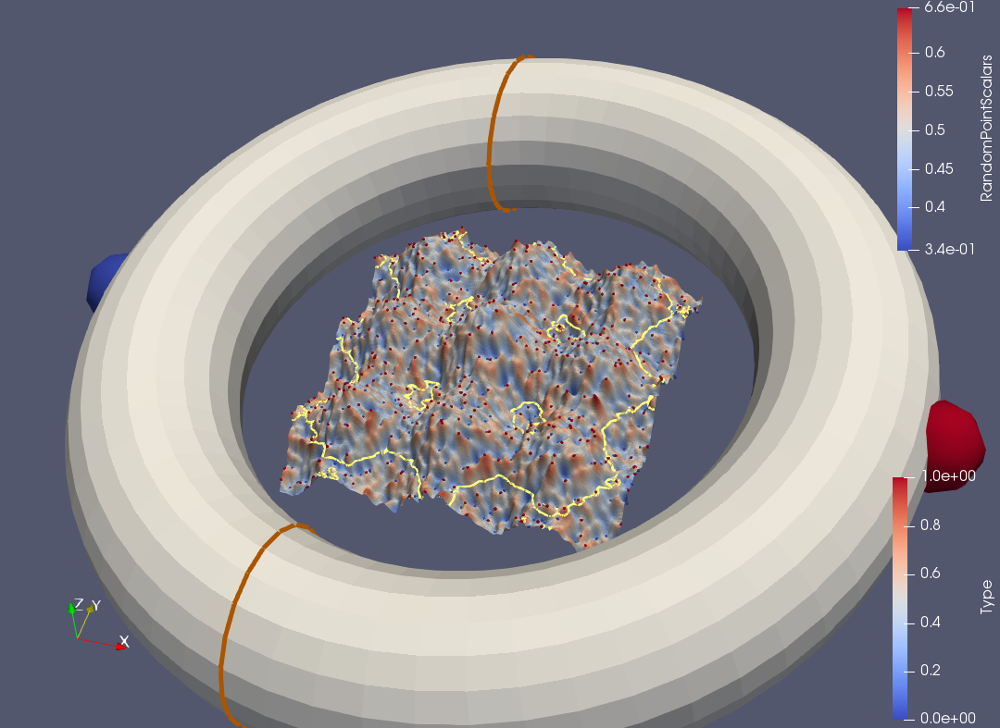
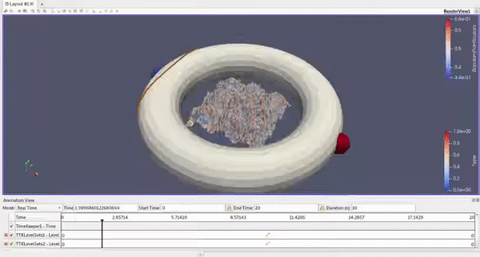

# Assignment 5 - Extending Paraview with a new module using TTK
## Done by : Shivam Pandit & Christin Wilson
### new-ttk-files folder contains required project files with updated levelsets.h file

In this assignment, we will extend Paraview with a new module for identifying critical points on a scalar field and for extracting isocontours on the same.

A few resources that you may find helpful
- the [video](https://drive.google.com/file/d/1FlrCtbu6K1t4oO38dTflzsZsWF-SszlC/view?usp=sharing) tutorial by the instructor
- the [video](https://topology-tool-kit.github.io/tutorials.html#newModule) tutorial on ttk.
- the ttk developer [documentation](https://topology-tool-kit.github.io/doc/html/index.html)
- the vtk developer [documentation](https://vtk.org/doc/nightly/html/)

### Creating the new module

From the terminal get inside the folder `ttk-0.9.8`, from there run the script

`./scripts/createTTKmodule.sh LevelSets`

This will create a series of subfolders in your project.
Substitute the files provided in this assignment with those automatically generated by TTK. Do not copy and paste the entire file. Take the time of studying the structure of each file and copy the code in the correct place within each file.

Watch the [video](https://drive.google.com/file/d/1FlrCtbu6K1t4oO38dTflzsZsWF-SszlC/view?usp=sharing) to understand the purpose of each file.

At this stage, you should be able to compile the new module by re-compiling the entire ttk project (notice, you do not have to recompile Paraview but only TTK). In general, run `cmake` on the ttk project once you have created a new module. After that, you can only run `make` every time you update something in your code. `cmake` and `make` should be quite smart, they will not recompile the entire project if nothing has changed in the other modules.

First try:
- Open Paraview after compiling the module.
- Open the file `torus.vtu` in Paraview
- Apply the module `LevelSets`

You will see that the module run without any issue but nothing happens. This because our module is not yet fully implemented

### Developing a new module. Phase 1, coding and debugging

For this assignment you will have to implement only two functions in `core/base/levelSets/LevelSets.h`
The two functions are `execute` and `findPoint`.

In the debugging phase, it is quite tedious to use Paraview for checking that everything is working. For this, we can use the program in `standalone/LevelSets/cmd` to run our module directly from the terminal.

Notice, once compiled, this program can be found in `ttk_install/bin/`

Before changing the code, try running the program with `./levelSetsCmd -i pathToTorusFile`.
You should get a series of prints from ttk showing that the program is working (but is not doing anything special).

Images from the paraview are added below:

Now you can start following the instructions within the file `LevelSets.h` for implementing your module.

### Developing a new module. Phase 2, debugging the module visually

Assuming that your code is working we want to check now that it is doing the right things. It is time to check the results by looking at them on Paraview.

Every time that you run `make install` you are automatically updating the module in Paraview. Let's go and check what is happening there.

By applying the module on `torus.vtu` the visualization will not be optimal. We can improve the rendering of the different objects a bit:
- on the torus, activate the visualization of the scalar field
- Output-0 contains the critical points, run a filter called `Glyph` and modify the glyph type to Sphere so to render the points as spheres. Apply a color map based on the type of critical point. Notice that you can change the size of the points from the Properties panel.
- Output-1 contains the isocontour. The line is not very clear. From the Properties panel increase the Line Width value. You can also change the color of the line.

If you have to try this multiple time you don't have to repeat the update of your settings over and over. When you are satisfied with the appearance of your dataset you can save by using the menu `File->Save State`. Then, the next time that you want to try the module you can simply run `File->Load State` right after starting Paraview.

Once the program is working, save the picture obtained and link them here in this README file.

### Developing a new module. Phase 3, stressing the module

Now that the program is running properly let's use a bigger dataset. Generate a new figure by using the dataset `noisyTerrain.vtu` by using the field `RandomPointScalars`.

Save the obtained image and add it here

Images from the paraview are added below:

### Bonus points (2 points) creating an animation with Paraview.

Now that we have a module and an input parameter we can easily create an animation out of it:
- Select the menu `View -> Animation View`.
- Add a new item to visualize, specifically select the level set module. This should automatically select `Level` as parameter on which running the animation.
- Change the mode from `Sequence` to `Real Time`
- Increase the Duration to 15 or 20 seconds
- Run the animation by clicking on the Play button (green button on the main window). You should see the isocontours "growing" on your image.

Record the animation in a video. Create a gif out of the video and link the gif here in this README file.

