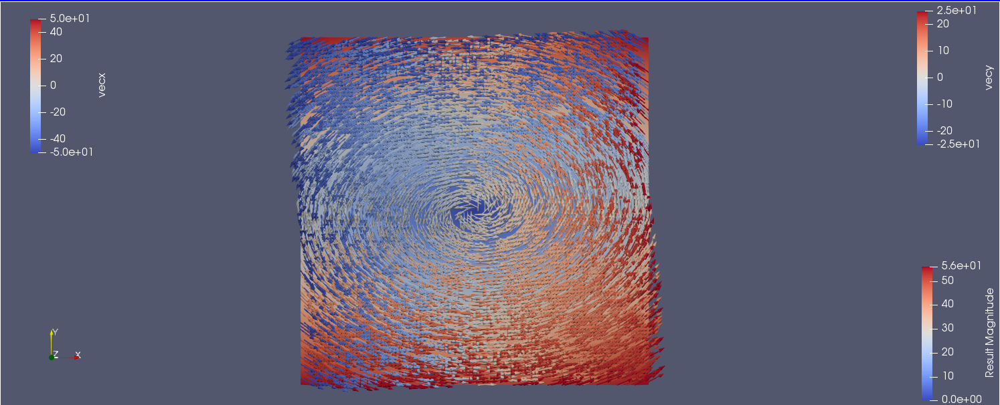
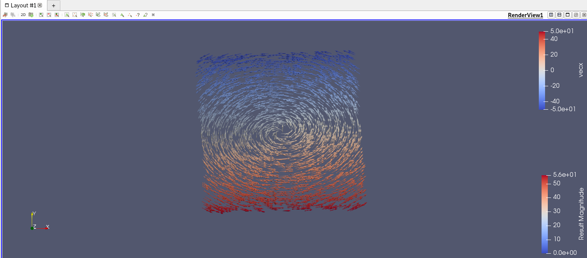
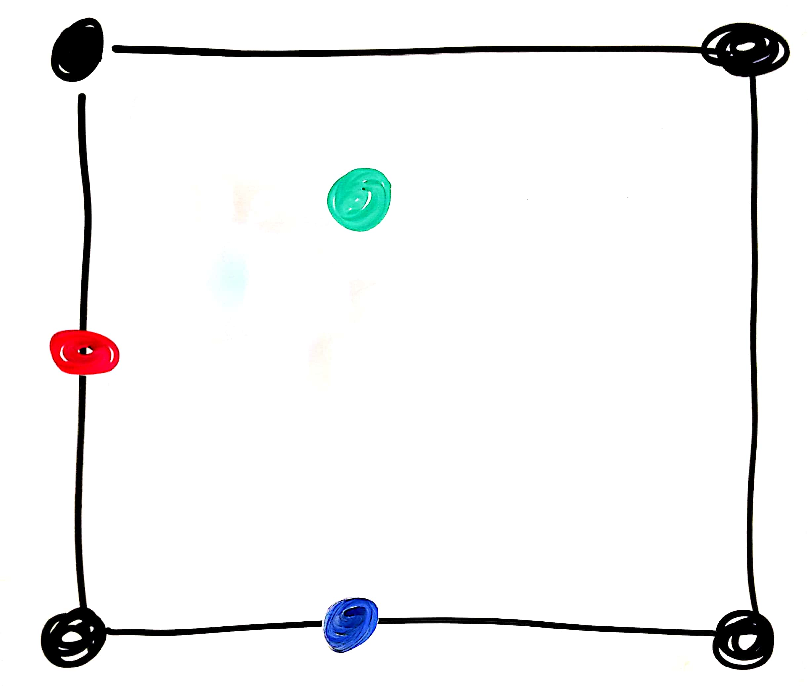
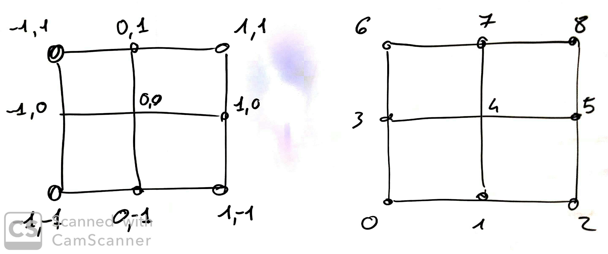
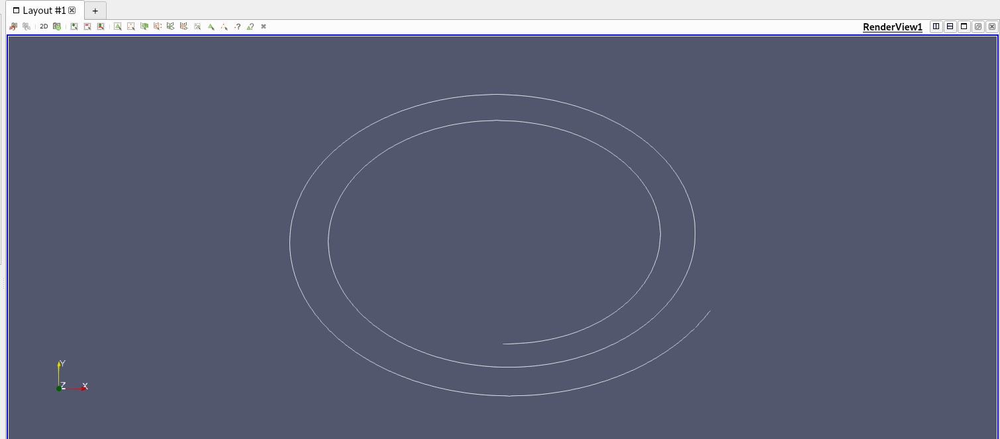
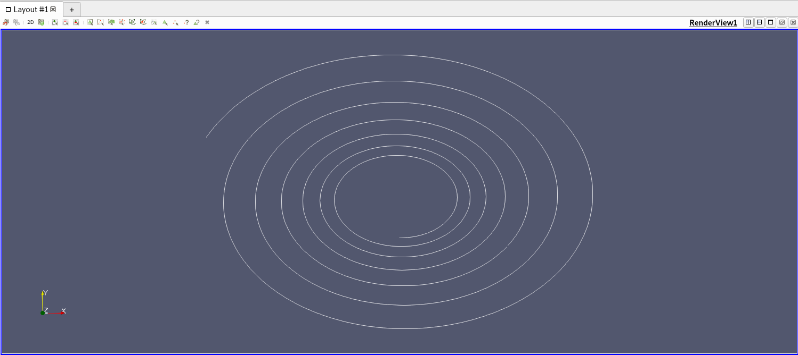
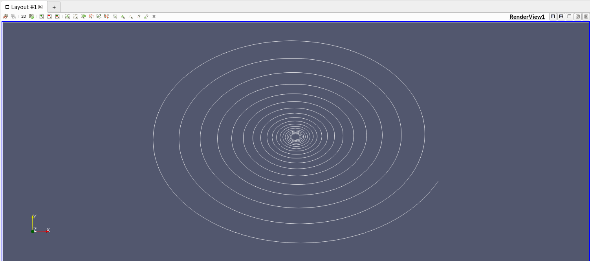

# Assignment 6 - Vector fields
## Done by : Shivam Pandit & Christin Wilson
### new-ttk-files folder contains required project files

In this assignment we will extend Paraview with a new module for tracing paths on a vector field. We will be implementing the Elure method seen in class.

You have three dataset for testing the method.
`vector_field5.vtk`, `vector_field10.vtk` and, `vector_field101.vtk`. These all represent the same vector function `f(x,y) = (-y,x/2)` on a gridded dataset of variable resolution (5x5, 11x11 and 101x101, respectively). You should start testing the module with the smallest one and then scale up to the others.

### Visualizing a vector field

Open the vector field `vector_field101.vtk` in Paraview.
You will notice this is encoded as an image (scalar field) having two components (vecx and vecy). This will simplify the processing of the vector fiedl in ttk. Still, if you want to visualize the vector field with glyphs this is doable by performing the following steps:

- Run the filter `Calculator` and type the following formula `(iHat*vecx) + (jHat*vecy)` below the field `Result Array Name`. Click Apply.
- Now you have obtained a vector field visualized based on its magnitude. Activate the `Glyph` filter on what you have obtained and you will see a lot of vectors represented as arrows. It is easy to see that the vector field represented is in the surrounding of an orbit. Draw glyphs of appropriate size, apply a color map to the underlying field showing the magnitude of the vector field. Save the obtained result and attach the image here.




### Module preparation

Let's start creating our module. Close paraview and create a blank module as usual with the script

`./script/createTTKmodule.sh VectorFieldEuler`

From the folder `./standalone/` remove the folder `VectorFieldEuler`

As last time you can modify the fields created by the script according to the files provided by the instructor. Notice that this time you will have to write new code by yourself in (almost) each single file and not only in the core implementation of the module.

#### Setup the Property panel in Paraview.

Here we will update the file `paraview/VectorFieldEuler/VectorFieldEuler.xml`

In the file provided you have everything set for defining what is the desired input `<InputProperty>` and how to import the vector field `<StringVectorProperty>`. We also set a slider already for providing a maximum number of steps for the algorithm to follow the particle `<IntVectorProperty>`. Now we need a second slider for defining the value deltaT for the algorithm.

Complete the code within for the `DoubleVectorProperty`. We need a slider with the following properties:
- number of elements 1
- default value = 0.5
- range of values going from 0.0001 and 1

In `command` you should put the name of the function that will be called when running the module.
Pick the function name as you please. We will be implementing the function at the next step.

#### The TTK module, handling input and output

Here we will update the file `core/vtk/vectorFieldEuler/ttkVectorFieldEuler.h`

Most things are implemented here.
What we miss is the function for reading the deltaT value from the xml file.

Notice that in the xml file, `<IntVectorProperty>` use the command `SetSteps` that is defined here in `ttkVectorFieldEuler.h`

Do a similar thing for deltaT. The function will have to save the value into variable Delta which is already defined in this file.


Here we will update the file `core/vtk/vectorFieldEuler/ttkVectorFieldEuler.cpp`

Everything is implemented except how the lines are drawn

The output is initialized with the following line
```c++
vtkUnstructuredGrid* outputline=vtkUnstructuredGrid::SafeDownCast(output);
```
after this you will have to push the lines to be drawn into output.
Take inspiration from the code in last assignment. You will see that the approach is practically the same since we are drawing lines from a sequence of points.


#### Implementing the real module

Here we will update the file `core/base/vectorFieldEuler/VectorFieldEuler.h`
Here is where the hard work starts. Take a moment to read the class variables. We have `inputDatax_` and `inputDatay_`, there are the variables storing the x and y component of each vertex. To be clear, for a the vertex of index `i` we can access the components of the vector defined there with `inputDatax_[i]` and `inputDatay_[i]`. The other variable stored here is the pointer to the triangulation, for this module we will need triangulation to access a point coordinates only (with `getVertexPoint(...)`).


#### Function execute, where it all begins
Let's start with `execute`, the function takes three inputs, `steps`, `delta` and a reference to lines which will be filled up with points by the function.
The first step is that of picking a seed, i.e., a starting point. I have done this for you.

```c++
pair<float,float> point;
point.first = 0;
point.second = -1;
```

Since we are working on a bidimensional vector field there is no need to work with the z-coordinate. So in the latter we will be representing points and vectors as pairs of floats, `point.first` is the x coordinate of the point and `point.second` is the y coordinate.
We also i

Now is time to implement the body of our function. You can take inspiration from the following algorithm.

```c++
for(number of steps){
  insert point into lines

  select next vertex //function pickNextVertex(...)

  if(new vertex is not valid) // we ended up outside of the domain
    break
}
```

#### Function pickNextVertex, the Euler method

Here is where we will apply the Euler formula. Notice that we have most of the stuff we need to apply said formula. We have the starting point (`point`) we have the integration step (`dt`) so we only need thee vector components at this point.

There are four cases

<br>


- black point: we are exactly at one of the points of the grid (we don't need interpolation)
- blue point: we are at one of the horizontal lines of the grid (we need linear interpolation)
- red point: we are at one of the vertical lines of the grid (we need linear interpolation)
- green point: we are inside one of the cells of the grid (we need bilinear interpolation)

Let's set some standard for our dataset which will simplify our search for a vertex:
- we assume to work with vector fields of equal size (that is, we have the same heigh and width resolution).
- we assume that points are equally spaced and have coordinates with no decimals. That means that points in the grid can have coordinates like (-2,1), (4,3), (0,1) but not like (2.1, 1.5), etc.

Back to our four cases, we can recognize if we are working on a black point with the following condition

```c++
point.first == floor(point.first) && point.second == floor(point.second)
```
### Why?

### That is because every point has a grid size of 1.


Then we can split our code into two parts: those requiring interpolation and those that do not.

##### Black point

This is the simplest case. We are at one of the points of the grid and we don't have to compute any vector because such vector is already provided in input. However, we still have to find where this vector is stored.

To do so, we use the function `coordsToVertex` that takes a points, as combination of two coordinates and return a vertex index. You will have to implement this function in `VectorFieldEuler.cpp`. Remember all the assumptions we just made for our dataset.

The following image shows you the possible input values you will get if you are working on a 3x3 vector field. Notice that all the points have x,y coordinates without decimals. Then, given as input any of those points, you want to return the index shown in the figure on the right. (this should generalize if your image is bigger).

<br>

Once you have found the correct index retrieving the x and y component for such vertex will be super easy.

##### Red, Blue or, Green point

These correspond to the cases where we don't know (yet) the value for a vector and so we need to find it by interpolation. If we are on a grid line, the job is a bit easier since we will only need linear interpolation. If we are inside a grid cell, we will need bilinear interpolation. My suggestion is to follow the description for linear/bilinear interpolation from [wikipedia](https://en.wikipedia.org/wiki/Bilinear_interpolation). In reference to the picture shown there,

<br>

I encourage you to use a similar notation to simplify the implementation of your function.

```c++
rename the coordinates of your input point //x,y
find the coordinates for Q11, Q12, Q21, Q22 //x1,y1,x2,y2
use coordsToVertex to find the indexes of said vertices //q11, q12, q21, q22

if(we are on a horizontal line){
  //apply linear interpolation x
}
else if(we are on a vertical line){
  //apply linear interpolation on y
}
else{
  //apply bilinear interpolation.
}
```

Notice that the formulas on wikipedia assume to work with a scalar value (for example, `f(Q11)` returns a single value). This should not scare you, in your case you will be working with each component separately (i.e., apply the formula to `inputDatax_` first and then to `inputDatay_`).


### Run and test the module

For a limitation of TTK you will not be able to run the standalone program from the terminal. This because ttk is capable of reading only vti files (images) while we are working on a structured grid. For similar reasons you cannot apply the module directly on the dataset provided in input. You will have to perform the following steps in Paraview:

- load the dataset
- apply the `Tetrahedralize` filter
- apply the `VectorFieldEuler` filter

Since these steps are a bit time consuming especially when you will have to debug the code over and over I suggest you to do the following. After you have created a decent visualization useful for debugging your code go on, `File`, `Save state`.

Next time you want to test the module just lunch paraview from the terminal, go on `File`, `Load module` and select the module you previously saved.


Once your module is implemented and functioning create a visualization combining glyphs and streamlines. Improve the appearence of the figure in the way you prefer and add the picture here.

Visualization for `vector_field5.vtk` vector field


Visualization for  `vector_field10.vtk` vector field


Visualization for  `vector_field100.vtk` vector field


## Bonus points - Runge Kutta algorithm (Points 2)

Extend the current implementation with the Runge-Kutta algorithm. The final implementation should show 1 line extracted with the Runge-Kutta approach and 1 line extracted with the Euler rmethod.

Add a picture of the result here.


## Bonus points - multiple seed points (Points 2)


Extend the current implementation with multiple seed points (at least 5). The final implementation should compute multiple stream lines starting from each of these points.

Add a picture of the result here.
