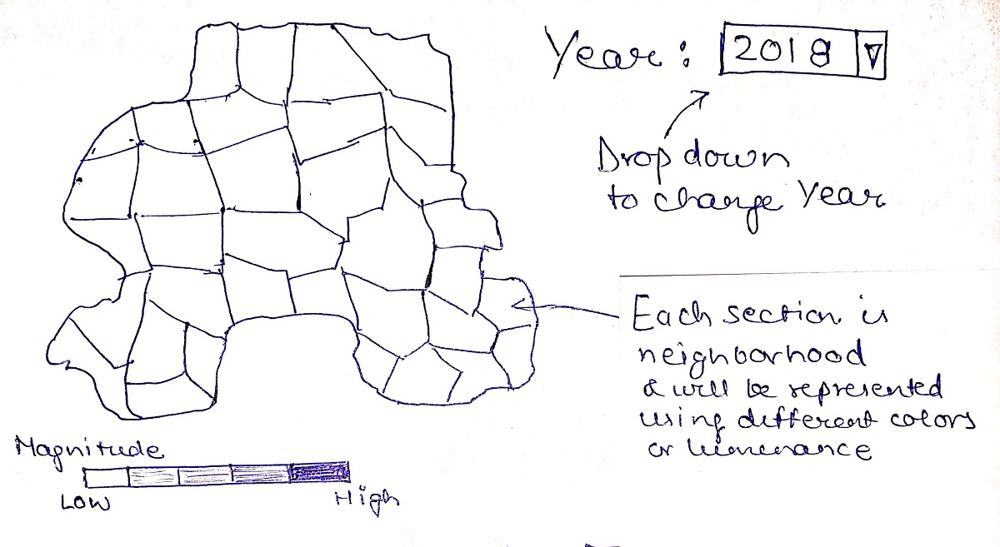
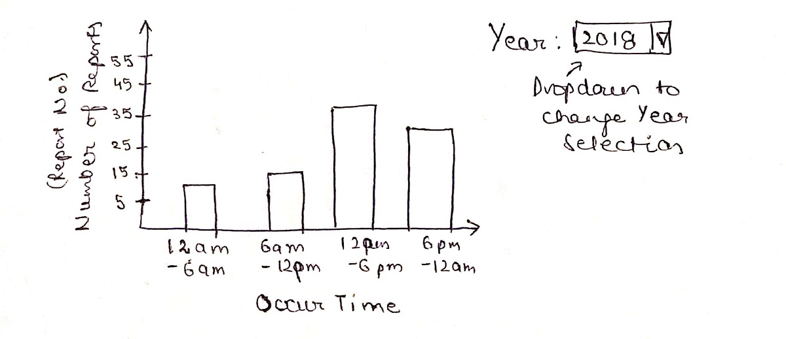
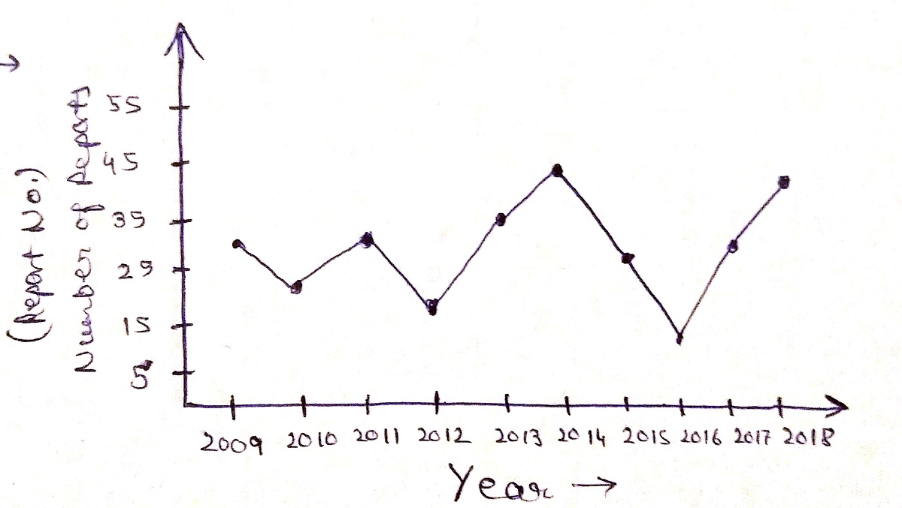
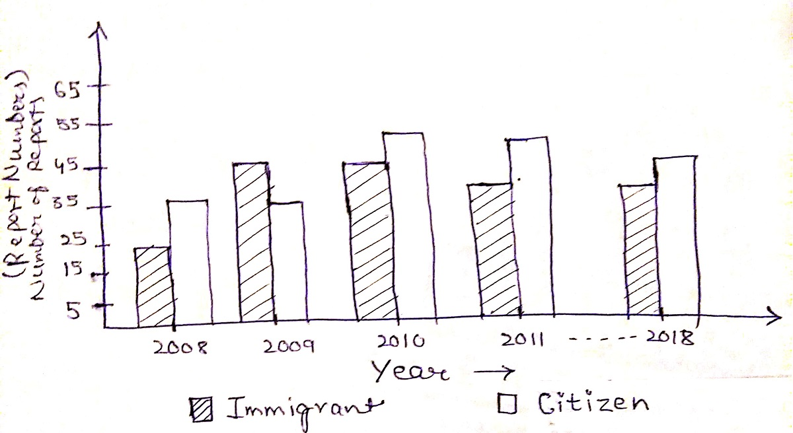
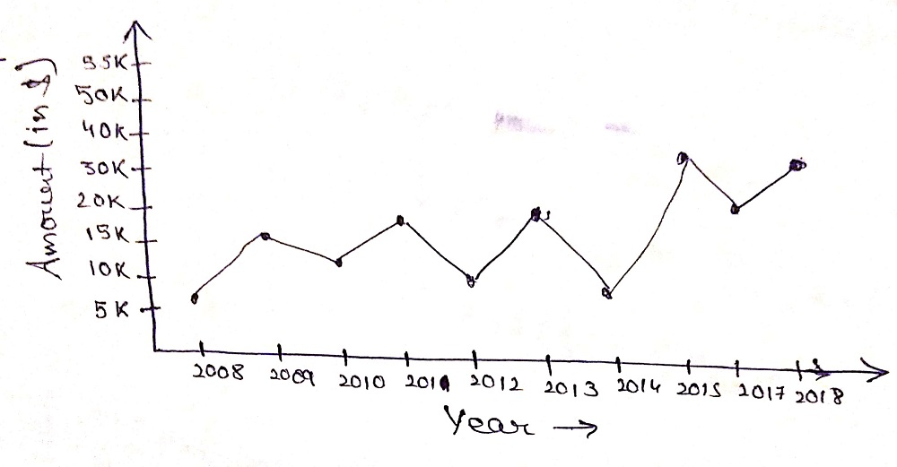
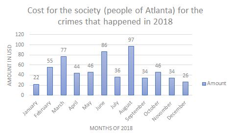
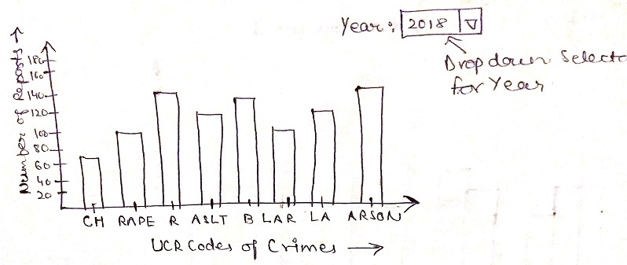

# Assignment 2 - Creating Charts

### Learning Goal
Train yourself in creating a visualization appropriate for a specific dataset.

### Dataset - Atlanta Crime dataset

This data details the crimes committed in the city/greater metropolitan area of Atlanta from the year 2009 to 2018.

The attributes of this dataset are: 

- Report Number
- Beat (In police terminology, a beat is the territory and time that a police officer patrols.)
- Report Date
- Occur Date and Time
- Apartment Number
- Location (Address)
- Shift Occurrence ( a value that can be [Morning, Day, Evening])
- UCR (Uniform Crime Reports) a code that represents the type of crime.
- Neighborhood
- NPU (Neighborhood planning unit) 25 values

### Instructions

#### Step 1

Make sure you have a clear understanding of what each attribute means and what values it contains (ask questions to the instructor if you have doubts).

#### Step 2

Create data visualization sketches to investigate the following questions. For each sketch describe in words what are the marks and channels that are used.

1. What are the most dangerous neighborhoods?
2. What are the most dangerous times of a day?
3. Are crimes increasing or decreasing since 2008?

#### Step 3

Now suppose to have the following additional data.

- Immigration status (this indicates the immigration status of the person reporting the crime can be either "Citizen" or "Immigrant")
- Amount (this indicates the amount of stolen/damaged goods)

Create data visualization sketches to investigate the following questions. For each sketch describe in words what are the marks and channels that are used.

4. Are immigrants more likely to get involved as a victim of a crime?
5. What is the cost for the society (people of Atlanta) for the crimes that happened in 2018?

#### Bonus

Define your own question and design a visualization for answering it.

### Submission

Modify this README file by adding sketches of the visualization designed. Pair each image with a description of the marks and channels used.

## Solutions

## 1. What are the most dangerous neighborhoods?

For representing this type of problem, choropleth is good where we can represent neighborhoods using different colors or luminance like dark and bright colors for more crime areas and light colors for low crime areas. There will also be a legend down the map that will show the magnitude of crime based on color magnitude.

Mark: Area

Attributes: Report number that will represent number of crimes is attribute of type quantitative represented as color, Neighborhood is attribute of type categorical and represented as area, Year is attribute of type ordinal. 

  

### 2. What are the most dangerous times of a day?

Bar chart is good for this type of visualization where times will be represented on x-axis and number of crimes on y-axis. I decided to take time ranges on x-axis than individual time values since time ranges give us better idea about what times are more incidents happening.

Mark: Line 

Attributes: : Number of Reports which will represent number of crimes is attribute of quantitative type and represented as position, Year is an attribute of type ordinal in this chart and is not encoded, time is attribute derived from occur date and time of type ordinal and represented as position.

  

### 3. Are crimes increasing or decreasing since 2008?

A line chart is good for this visualization where x-axis will represent year and y-axis will represent number of reports that is showing number of crimes.

Marks: Points and line 

Attributes: Year is attribute of type categorical derived from occur data and time attribute represented as position, Number of reports is representing number of crimes is of type quantitative and represented using the position.

  

### 4. Are immigrants more likely to get involved as a victim of a crime?

A multi-set bar chart is good for this type of visualization where 2 combined bars will represent immigrants and non-immigrants using different shaded bars side by side with years on x-axis and number of reports representing number of crimes on y-axis.

Marks: Lines

Attributes: Year is attribute derived from occur date and time of type categorical and represented as position, Number of reports represents number of crimes is of quantitative type and represented as position for immigrant and non-immigrant (Immigration Status) different shaded bars

### 5. What is the cost for the society (people of Atlanta) for the crimes that happened in 2018?

Scatterplot is good for representing this type of visualization with years on y-axis and amount on x-axis. Though it is just mentioned crimes happened in 2018 for the problem which will be just one value for amount, so I chose to include all years to get better idea how costs have changed till now.

Marks: Points and lines

Attributes: Year is attribute derived from occur date and time of type categorical and represented as position on x-axis, Amount is of type quantitative and represented as position on y-axis

#### Alternate solution
We can also visualize this by having months of 2018 on x-axis and amount (in usd) on y-axis if we just want costs for 2018. This will give us costs to society for every month of 2018

Mark: Lines

Attributes: Month is of type categorical and represented as position on x-axis, Amount is of type quantitative and represented as position on y-axis

### BONUS QUESTION
### 6. What crimes are more prominent among the reported ones from part1 offences?

A bar chart is good for this type of visualization where each bar will represent different types of crimes represented by there UCR codes on x-axis and number of reports which represents the number of crimes on y-axis

Mark: Lines

Attributes: Year is an attribute of type ordinal in this chart and is not encoded, Number of reports represents number of crimes is of quantitative type and represented as position on y-axis, UCR codes of crimes is of type categorical and represented as position on x-axis.

