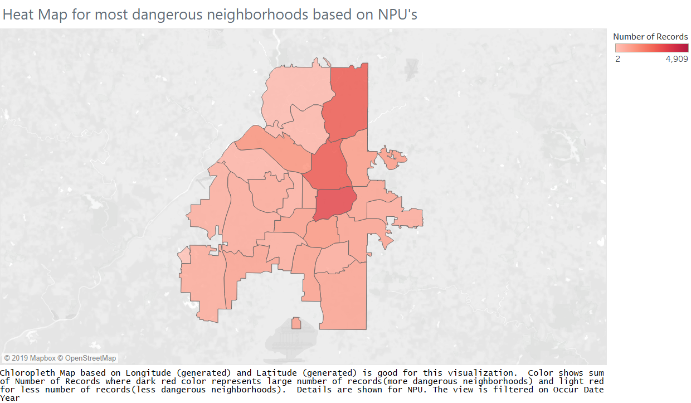
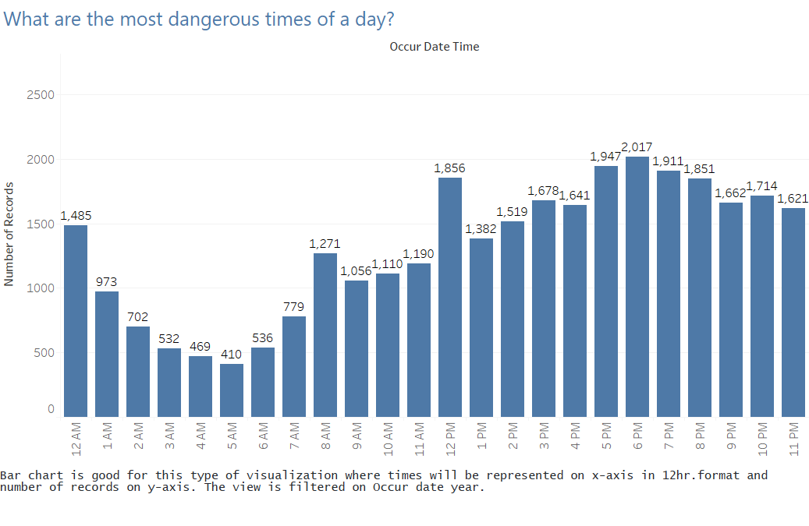
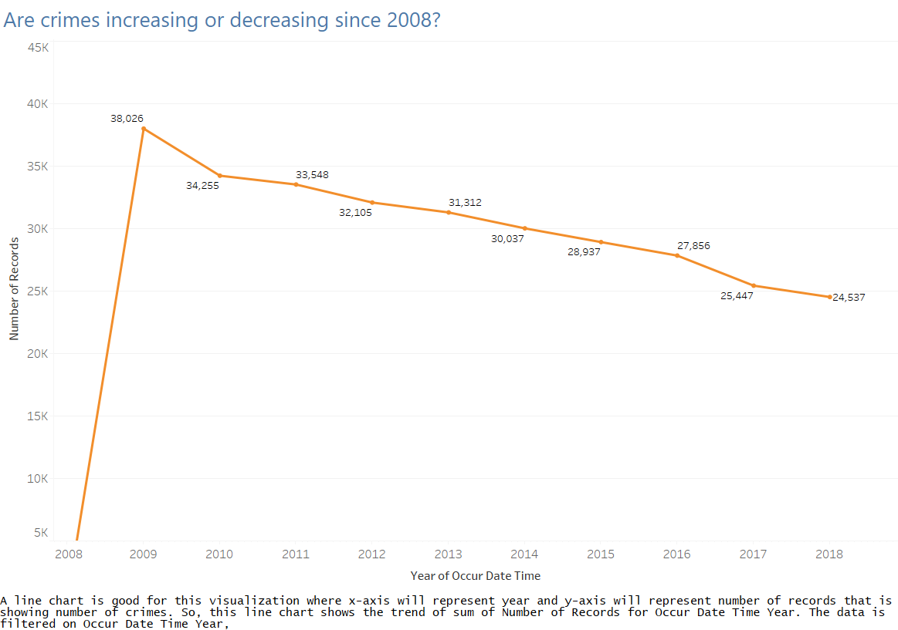
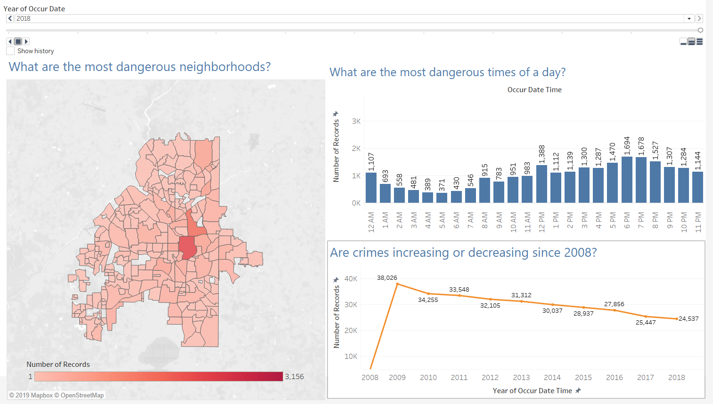

# Assignment 3 - Creating Charts in Tableau

### Learning Goal
Train yourself in using Tableau for creating effective visualizations

### Instructions

#### Step 1 - Loading and preparing the Atlanta Crime dataset

The dataset we are going to analyze details the crimes committed in the city/greater metropolitan area of Atlanta from the year 2009 to 2018. This will be very similar to the dataset we used in Assignment 2.

- Load the dataset in Tableau (you can just drag and drop the csv file on the main window)
- Select the type Extract as type of connection. This will force Tableau to extract the information from the .csv file and import it into its own format (as a result you will be using more memory but all the interactions will be faster).
- Take a look at the data extracted and familiarize with the dataset. We will need to solve a few issues before proceeding with producing some visualization.

- Problem 1, `Occur Date` and `Occur Time` are treated as different columns. As a result, `Occur Time` is not recognized as a variable indicating time. To solve this we will have to create a new field.
  - Click on `Occur Time` and select `Create a calculated field`. Now we have to write a formula for merging `Occur Date` and `Occur Time`. To do this we will be using the functions `MAKEDATETIME`, `MAKETIME` and `INT`.
  - Take your time to familiarize with these functions by writing them into the calculation field. The interpreter will tell you if there are syntax errors in your function. You want to write down something `MAKEDATETIME(the date goes here, MAKETIME(hour goes here, minutes go here, this can be always 0))`.
  - Repeat the same with `Possible Date` and `Possible Time`.

- Problem 2, `NPU` refers to the Neighborhood Planning Unit. The City of Atlanta is divided into twenty-five (25) Neighborhood Planning Units (NPUs), which are citizen advisory councils that make recommendations to the Mayor and City Council on zoning, land use, and other planning-related matters. In the current dataset we do have the name of the NPU where a crime has been committed but we do not have any geometry telling us where the NPU is in practice. We need those information if we want to create a map.

  - Luckily, we live in a world where open data are more and more common. These type of geometrical data (used in Geographical Information Systems) are generally encoded as Shapefiles (.shp). With a quick search on google we can find the Shapefile we need [here](https://dcp-coaplangis.opendata.arcgis.com/datasets/npu).

  - I have already downloaded the files for you and you can find them in the folder NPU. Now, go back to Tableau to the `Data source` view.
  - Add the NPU.shp file here. There will be no need to read the other files. They will be included automatically.
  - Now you should be in the situation where the two datasets are linked by a inner join. That means that for each row of the `COBRA` dataset we have additional attributes telling us information about the geometry of the NPU. However, we do have an issue. The join is happening on attributes that do not match and, for this reason, we no longer see any values in the table.
  - To solve this, click on the icon of the inner join and select `Name` as the attribute to be used for the NPU dataset, to perform the join. Now your table rows should be back

- Problem 3, `Neighborhood` refer to an organization of the city of Atlanta which is at a smaller granularity with respect to the NPUs. Creating maps based on this subdivision could be helpful too. Replicate the same pipeline used for the NPUs. Shape files for the Neighborhoods can be found in the folder Neighborhood (or downloaded from the same website as before).

#### Step 2 - Playing with the brand new geometries.

Let's try to create a heatmap simply showing the number of crimes reported since 2009 on each NPU.

- Start a new Worksheet.
- From NPU.shp drag and drop the `Geometry` field. This should get you a nice representation of each NPU based on their boundaries.
- To create the heatmap we need to show the total number of crimes reported on each NPU. We need the field `Number of records` for doing this. Drag and drop such field into the Marks area and select `Color` as a channel to be used.
- Sadly, Tableau does not understand how to aggregate data, but that is going to be a very easy fix. Just drop and drop the `NPU` field from `COBRA` into the Marks area and BOOM, we will get what we were searching for.

After following the steps we get the heatmap shown below:

#### Step 3 - From sketches to visualizations.

Take the sketches you made during assignment 2 for answering the following questions

1. What are the most dangerous neighborhoods?
2. What are the most dangerous times of day?
3. Are crimes increasing or decreasing since 2008?

Create three worksheets either by implementing your original sketches submitted for Assignment 2 or by creating brand new visualizations.

#### Step 4 - Create a Dashboard

Create a dashboard for studying the crimes in the city of Atlanta. The dashboard will have to integrate filtering and interactive techniques for studying how crimes changed over time (years). The dashboard will have to include also a map for showing the geographical distribution of the crimes.

### Submission

Upload your Tableau workbook.

Modify this README file adding the visualization produced as images. For each image explain your design choices. For the dashboard, explain the interactions provided by the dashboard.

### Solutions
Design choices for each visualization is mentioned below the visualizations.

## 1. What are the most dangerous neighborhoods?

## 2. What are the most dangerous times of day?

## 3. Are crimes increasing or decreasing since 2008?

## Dashboard

For all the visualizations asked, dashboard was made which is shown below. There is a year selector that will change the heatmap of dangerous neighborhoods of Atlanta and most dangerous times of a day based on year selected. There is also a visualization for crime trends from 2008 to 2018 that won’t change based on year selector as it contains all years.

### I have attached my Tableau workbook with name Shivam_Workbook.twb

